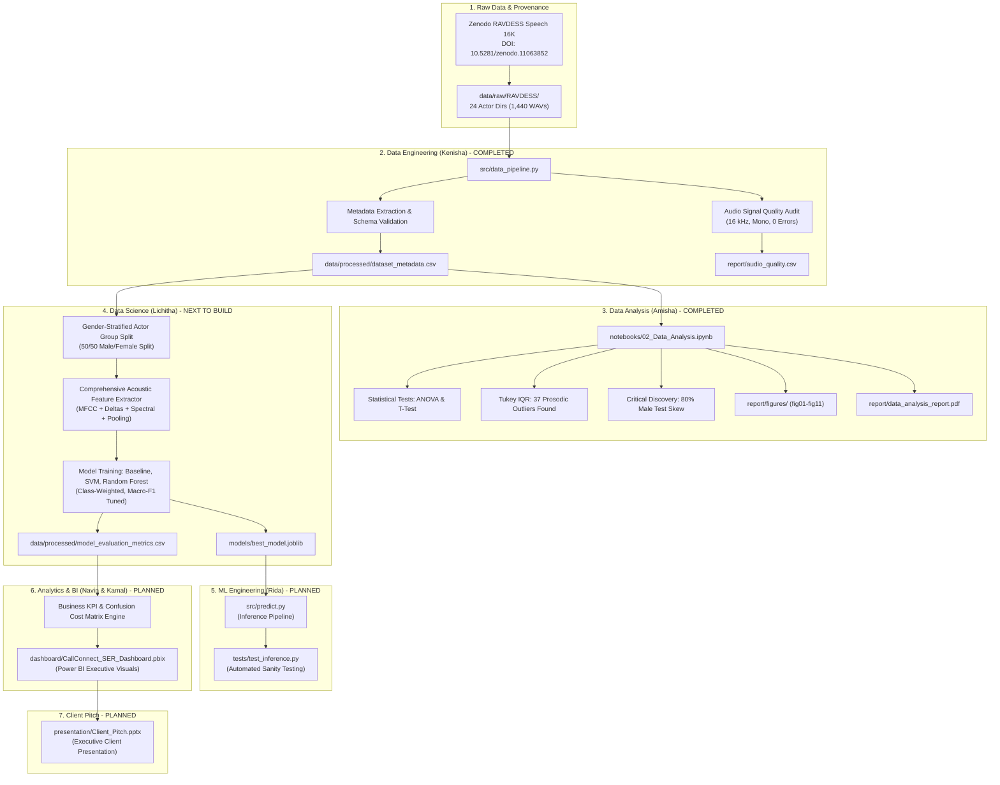

# PROJECT HANDOVER: Speech Emotion Classification using RAVDESS

> **Single Source of Truth & Master Handover Record**  
> **Repository:** `https://github.com/kenishadennis06-create/Group-2-Speech-Recognition-Emotion-Classification-`  
> **Domain:** Customer Support / CallConnect Speech  
> **Master File Location:** [PROJECT_HANDOVER.md](file:///c:/xampp/htdocs/PROJECT/ml_project/Group-2-Speech-Recognition-Emotion-Classification-/docs/PROJECT_HANDOVER.md)  
> **Audit Status:** VERIFIED THROUGH COMPREHENSIVE REPOSITORY CODE & DATA AUDIT

---

## 1. Project Overview

This project implements an end-to-end Machine Learning system for automated **Speech Emotion Recognition (SER)** tailored for enterprise customer support contact centers (**CallConnect Speech**). Using the standardized 16 kHz Ryerson Audio-Visual Database of Emotional Speech and Song (**RAVDESS**), the system classifies vocal interactions into eight discrete emotional categories to detect caller frustration, distress, or satisfaction in real time.

The project is structured according to an enterprise 12-stage ML lifecycle executed across six specialized engineering roles:
1. **Data Engineer (DE)**: Kenisha (241BCADA31)
2. **Data Analyst (DA)**: Amisha Rashmi Casba (241BCADA57)
3. **Data Scientist (DS)**: Lichitha K.B (241BCADA05)
4. **ML Engineer (MLE)**: Rida (241BCADA37)
5. **Analytics Engineer (AE)**: Navin (241BCADA35)
6. **BI / Power BI Developer & Team Leader (BI)**: Kamal (241BCADA59)

---

## 2. Business Problem

### Operational Context: CallConnect Speech Contact Center
Customer interaction platforms process tens of thousands of inbound and outbound customer support calls daily. In high-stakes support environments:
- Escalated customer frustration and anger frequently go unnoticed until churn occurs or callers demand supervisor intervention.
- Post-call reviews are manual, sampling fewer than 2% of completed interactions.
- Acoustic tone and prosody convey urgency and distress long before text transcripts reflect explicit keywords.

### Target Objectives
1. **Automated Escalation Routing**: Flag high-arousal negative emotions (`angry`, `fearful`, `disgust`) for dynamic real-time agent assist or supervisor intervention.
2. **Churn Prevention & Retention Prioritization**: Route callers exhibiting persistent distress (`sad`, `fearful`) to high-empathy retention specialists.
3. **Objective Quality Assurance**: Track customer emotional trajectory (e.g., transition from `angry` at call inception to `calm` or `happy` at resolution) as a KPI of representative effectiveness.

### Target Classification Classes
The system targets 8 discrete emotion classes:
`neutral` (1), `calm` (2), `happy` (3), `sad` (4), `angry` (5), `fearful` (6), `disgust` (7), `surprised` (8).

---

## 3. Dataset

### Provenance & Acquisition
- **Dataset Name:** RAVDESS Speech 16K (Ryerson Audio-Visual Database of Emotional Speech and Song)
- **Source:** Zenodo ([DOI: 10.5281/zenodo.11063852](https://doi.org/10.5281/zenodo.11063852))
- **Authors/Collectors:** Steven R. Livingstone & Frank A. Russo
- **Release Version:** 16 kHz speech release (published April 25, 2024)
- **Archive Used:** `Audio_Speech_Actors_01-24_16k.zip`
- **License:** Creative Commons Attribution-NonCommercial-ShareAlike 4.0 International (CC BY-NC-SA 4.0)

### Verified Physical Dataset Properties
- **Total Audio Files:** 1,440 `.wav` files
- **Total Actors:** 24 professional vocal actors (12 male: odd IDs; 12 female: even IDs)
- **Actor Directories:** Exactly 24 directories (`Actor_01` through `Actor_24`)
- **Samples per Actor:** Exactly 60 speech utterances per actor
- **Sampling Rate:** 16,000 Hz (100% verified across all 1,440 files)
- **Channel Count:** 1 (mono channel, 100% verified across all 1,440 files)
- **File Format:** 16-bit uncompressed PCM WAV
- **Duration Characteristics:**
  - Mean Duration: 3.7007 s ($\pm 0.3367\text{ s}$)
  - Minimum Duration: 2.9363 s
  - Median Duration: 3.6704 s
  - Maximum Duration: 5.2719 s
- **Audio Integrity:** 1,440/1,440 files readable with 0 corrupted files or bitstream errors.

### Filename Parsing Schema
RAVDESS filenames follow a strict 7-component identifier convention: `03-01-XX-YY-ZZ-AA-BB.wav`
1. `Modality`: `03` (Audio-only)
2. `Vocal Channel`: `01` (Speech)
3. `Emotion Code`: `01` to `08` (`01`=neutral, `02`=calm, `03`=happy, `04`=sad, `05`=angry, `06`=fearful, `07`=disgust, `08`=surprised)
4. `Intensity`: `01` (Normal), `02` (Strong) — *Note: Neutral speech only has intensity `01`*
5. `Statement`: `01` ("Kids are talking by the door"), `02` ("Dogs are sitting by the door")
6. `Repetition`: `01` (1st repetition), `02` (2nd repetition)
7. `Actor ID`: `01` to `24` (Odd = Male, Even = Female)

---

## 4. Team and Responsibilities

| Role | Member Name | Student ID | Formal Responsibilities | Git Activity Verified |
| :--- | :--- | :--- | :--- | :--- |
| **Data Engineer (DE)** | Kenisha | 241BCADA31 | Ingestion, schema validation, corruption audit, actor leakage control, baseline metadata & feature extraction, data documentation. | **Yes** (Commits: `44c8334`, `198304d`, `0c7d509`) |
| **Data Analyst (DA)** | Amisha Rashmi Casba | 241BCADA57 | EDA, distributional audits, hypothesis testing (ANOVA, t-test), outlier diagnostics, validation audit, 3 actionable insights, DA report. | **Yes** (Commit: `c9818dc`) |
| **Data Scientist (DS)** | Lichitha K.B | 241BCADA05 | Modeling strategy, advanced feature engineering, leakage-free validation, baseline & candidate models, hyperparameter tuning, model artifact. | **No** (0 Git commits to date) |
| **ML Engineer (MLE)** | Rida | 241BCADA37 | Reproducible prediction pipeline (`predict.py`), dependency management, sanity tests, input validation, latency & monitoring design. | **No** (0 Git commits to date) |
| **Analytics Engineer (AE)** | Navin | 241BCADA35 | Business metric translation, KPI tables, threshold analysis, confusion cost matrix, Type I / Type II error economic quantification. | **No** (0 Git commits to date) |
| **BI Developer & Lead** | Kamal | 241BCADA59 | Project leadership, weekly reporting, executive Power BI dashboard, 3-6 KPIs, model evaluation visuals, slicers, single-record tester. | **Yes** (Commits: `f0a5b8e`, `78a6a2e`) |

---

## 5. Current Overall Status

| Metric / Stage | Current Status | Description & Verified Evidence |
| :--- | :--- | :--- |
| **Data Engineering** | **COMPLETED** | 1,440 files ingested, verified 0 corruptions, clean metadata generated, baseline MFCC extracted. |
| **Data Analysis** | **COMPLETED** | Full EDA executed in `02_Data_Analysis.ipynb`, 11 figures saved, 5-page PDF report compiled, 3 actionable insights delivered. |
| **Data Science** | **NOT STARTED** | Baseline MFCCs exist from DE notebook, but no model training, tuning, or candidate models exist. |
| **ML Engineering** | **NOT STARTED** | No `predict.py`, no inference scripts, no sanity test suite exist. |
| **Analytics Engineering**| **NOT STARTED** | No business KPI tables, escalation rules, or confusion cost matrices exist. |
| **BI / Power BI** | **NOT STARTED** | No `.pbix` file, dashboard folder, or BI visuals exist. |
| **Client Pitch** | **NOT STARTED** | `presentation/Client_Pitch.pptx` is an empty shell with 0 slides. |
| **Weekly Reporting** | **IN PROGRESS** | `weekly_updates/Group2_Update1.docx` completed for Week 1 (18 Sep 2026). Subsequent weeks pending. |

---

## 6. Complete Lifecycle Status

| Lifecycle Stage | Status | Responsible Owner | Verified Artifacts / Evidence | Next Required Action |
| :--- | :--- | :--- | :--- | :--- |
| **1. Problem Definition** | **COMPLETED** | Team | Documented in `README.md`, `dataset_documentation.docx`, and `data_analysis_report.pdf`. | Align final pitch with CallConnect Speech problem framing. |
| **2. Data Acquisition / Provenance** | **COMPLETED** | Kenisha (DE) | Zenodo DOI 10.5281/zenodo.11063852; 1,440 raw `.wav` files committed under `data/raw/RAVDESS/`. | None. Raw data is fully secured. |
| **3. Data Ingestion / Sanitization** | **COMPLETED** | Kenisha (DE) | `src/data_pipeline.py`, `data/processed/dataset_metadata.csv`, `report/audio_quality.csv`. | Fix empty column issue in `corrupted_files.csv`. |
| **4. EDA & Anomaly Detection** | **COMPLETED** | Amisha (DA) | `notebooks/02_Data_Analysis.ipynb`, `report/figures/fig01-fig11`, `report/data_analysis_report.pdf`. | Implement DA recommendations in modeling stage. |
| **5. Feature Engineering** | **IN PROGRESS** | Lichitha (DS) | Preliminary 40-MFCC mean features exist in `data/processed/train_features.csv` and `test_features.csv`. | Build comprehensive feature pipeline (Delta MFCC, Spectral Contrast, std pooling). |
| **6. Leakage-Free Validation** | **CONFLICTING / BLOCKED** | Lichitha (DS) | Existing `GroupShuffleSplit` in DE prevents actor leakage but introduces severe 80/20 gender skew. | Implement Gender-Stratified Actor Group K-Fold split. |
| **7. Baseline / Advanced Models** | **NOT STARTED** | Lichitha (DS) | None. No model code in `src/` or `notebooks/`. | Train Logistic Regression baseline, SVM (RBF), Random Forest. |
| **8. Multi-Metric Evaluation** | **NOT STARTED** | Lichitha (DS) | None. | Benchmark Macro-F1, balanced accuracy, per-class recall, and confusion matrix. |
| **9. Error Diagnostics** | **NOT STARTED** | Lichitha (DS) | None. | Analyze emotion confusion pairs (e.g., `angry` vs `happy` high arousal confusion). |
| **10. Analytics Engine** | **NOT STARTED** | Navin (AE) | None. | Build business KPI transformation module and confusion cost matrix. |
| **11. Interactive BI Dashboard** | **NOT STARTED** | Kamal (BI) | None. No dashboard folder or `.pbix` file. | Create Power BI executive dashboard connected to model evaluation tables. |
| **12. Client Pitch** | **NOT STARTED** | Kamal / Team | `presentation/Client_Pitch.pptx` is empty (0 slides). | Author complete 10-14 slide business and technical pitch deck. |

---

## 7. Repository Structure

```text
Group-2-Speech-Recognition-Emotion-Classification/
│
├── .git/                                   # Git revision control directory
├── .gitignore                              # Git ignore rules
├── .vscode/                                # VSCode configuration directory
│   └── settings.json                       # [WARNING: Contains machine-specific hardcoded paths]
│
├── data/
│   ├── raw/
│   │   └── RAVDESS/                        # 1,440 raw WAV files across 24 actor directories
│   │       ├── Actor_01/                   # 60 speech files (Male)
│   │       ├── Actor_02/                   # 60 speech files (Female)
│   │       ├── ...                         # Actor_03 through Actor_23
│   │       └── Actor_24/                   # 60 speech files (Female)
│   │
│   └── processed/
│       ├── dataset_metadata.csv            # Consolidated metadata for all 1,440 audio files (16 cols)
│       ├── train_metadata.csv              # Training partition metadata (1,140 samples, 19 actors)
│       ├── test_metadata.csv               # Test partition metadata (300 samples, 5 actors)
│       ├── train_features.csv              # 40-MFCC mean pooled training features (1,140 rows x 42 cols)
│       └── test_features.csv               # 40-MFCC mean pooled testing features (300 rows x 42 cols)
│
├── docs/                                   # Project documentation directory
│   └── PROJECT_HANDOVER.md                 # [THIS FILE] Master single-file project handover
│
├── notebooks/
│   ├── 01_Data_Engineering.ipynb          # DE interactive notebook: validation & MFCC extraction
│   └── 02_Data_Analysis.ipynb             # DA interactive notebook: complete statistical EDA & insights
│
├── presentation/
│   └── Client_Pitch.pptx                   # Presentation deck [CRITICAL: Empty file, 0 slides]
│
├── report/
│   ├── audio_quality.csv                   # Signal attributes (sample rate, channels, duration) for 1,440 files
│   ├── corrupted_files.csv                 # Log of corrupted files [CRITICAL: Empty, 0 columns]
│   ├── data_quality_audit.csv              # Summary metrics of DE ingestion checks
│   ├── dataset_documentation.docx          # Formal Data Engineering documentation (Zenodo, schema, etc.)
│   ├── data_analysis_report.pdf            # Formal 5-page Data Analysis & Statistical Audit PDF report
│   └── figures/                            # 11 EDA visualization plots (PNG)
│       ├── fig01_emotion_distribution.png
│       ├── fig02_emotion_percentage_donut.png
│       ├── fig03_actor_distribution.png
│       ├── fig04_duration_histogram.png
│       ├── fig05_duration_boxplot.png
│       ├── fig06_duration_by_emotion.png
│       ├── fig07_sample_rate_distribution.png
│       ├── fig08_channel_distribution.png
│       ├── fig09_actor_emotion_heatmap.png
│       ├── fig10_duration_by_intensity.png
│       └── fig11_train_test_split_gender.png
│
├── src/
│   ├── __pycache__/                        # Compiled bytecode
│   └── data_pipeline.py                    # Reusable modular Data Engineering pipeline script
│
├── weekly_updates/
│   └── Group2_Update1.docx                 # Formal weekly progress report (Week ending 18 Sep 2026)
│
├── pyrightconfig.json                      # Type checker config [WARNING: Contains hardcoded local paths]
├── requirements.txt                        # Core project Python dependency specifications
└── README.md                               # Project landing page and quickstart guide
```

---

## 8. Complete File Inventory

| Relative File Path | Purpose | Owner | Status | Dependencies | Notes & Audit Observations |
| :--- | :--- | :--- | :--- | :--- | :--- |
| `README.md` | Project landing page & quickstart | Kamal / Kenisha | **COMPLETED** | None | Accurately documents DE/DA completion; lacks DS/MLE run steps. |
| `requirements.txt` | Python dependency list | Kenisha / Rida | **COMPLETED** | pip | Covers DE/DA; needs modeling libraries (`joblib`, `xgboost`). |
| `.gitignore` | Git file exclusions | Team | **COMPLETED** | Git | Excludes `.venv/`, `.vscode/`, `__pycache__/`. |
| `.vscode/settings.json` | Editor workspace settings | Kenisha | **CONFLICTING** | VSCode | Contains machine-specific path `C:\Users\kenis\...`; committed despite `.gitignore`. |
| `pyrightconfig.json` | Pyright type configuration | Kenisha | **CONFLICTING** | Pyright | Contains local path `C:/Users/kenis/...` and stale paths `data/RAVDESS/src`. |
| `src/data_pipeline.py` | Modular DE pipeline script | Kenisha | **COMPLETED** | `librosa`, `soundfile`, `pandas` | Fully functional; performs ingestion, audio audit, metadata & split. |
| `notebooks/01_Data_Engineering.ipynb` | DE interactive walkthrough | Kenisha | **COMPLETED** | `src/data_pipeline.py` | Fully executed; extracts preliminary 40-MFCC feature matrices. |
| `notebooks/02_Data_Analysis.ipynb` | Complete EDA & hypothesis testing | Amisha | **COMPLETED** | `data/processed/dataset_metadata.csv` | Fully executed; generates 11 figures, statistical tests, 3 insights. |
| `data/processed/dataset_metadata.csv` | Clean dataset metadata (1,440 rows) | Kenisha | **COMPLETED** | `src/data_pipeline.py` | 16 columns; zero missing values; verified schema. |
| `data/processed/train_metadata.csv` | Training metadata (1,140 rows) | Kenisha | **COMPLETED** | `src/data_pipeline.py` | 19 actors; zero actor overlap with test. |
| `data/processed/test_metadata.csv` | Test metadata (300 rows) | Kenisha | **COMPLETED** | `src/data_pipeline.py` | 5 actors (Actors 01, 09, 12, 17, 19); severe gender skew (80% male). |
| `data/processed/train_features.csv` | 40-MFCC training features (1,140 rows) | Kenisha | **IMPLEMENTED BUT NOT VERIFIED** | `01_Data_Engineering.ipynb` | Extracted via mean-pooling; not produced by `data_pipeline.py`. |
| `data/processed/test_features.csv` | 40-MFCC test features (300 rows) | Kenisha | **IMPLEMENTED BUT NOT VERIFIED** | `01_Data_Engineering.ipynb` | Extracted via mean-pooling; not produced by `data_pipeline.py`. |
| `report/audio_quality.csv` | Audio signal attributes (1,440 rows) | Kenisha | **COMPLETED** | `src/data_pipeline.py` | Verifies 16 kHz sample rate and mono channel across all files. |
| `report/corrupted_files.csv` | Corrupted audio error log | Kenisha | **FAILED** | `src/data_pipeline.py` | Empty 2-byte file with 0 columns; throws `EmptyDataError` when read by pandas. |
| `report/data_quality_audit.csv` | Quality check summary table | Kenisha | **CONFLICTING** | `src/data_pipeline.py` | Single-row format; overwrites 19-row vertical table from notebook 01. |
| `report/dataset_documentation.docx` | Formal DE documentation | Kenisha | **COMPLETED** | None | Thorough documentation covering Zenodo provenance, schema, viva prep. |
| `report/data_analysis_report.pdf` | Formal DA audit & statistical report | Amisha | **COMPLETED** | `reportlab` | 5-page publication-grade PDF report compiled 19 Sep 2026. |
| `report/figures/fig01_emotion_distribution.png` | Bar chart of emotion class counts | Amisha | **COMPLETED** | `02_Data_Analysis.ipynb` | Confirms 1:2 underrepresentation of neutral emotion. |
| `report/figures/fig02_emotion_percentage_donut.png`| Donut chart of emotion percentages | Amisha | **COMPLETED** | `02_Data_Analysis.ipynb` | Shows 13.33% per class vs 6.67% neutral. |
| `report/figures/fig03_actor_distribution.png` | Bar chart of utterances per actor | Amisha | **COMPLETED** | `02_Data_Analysis.ipynb` | Confirms exactly 60 utterances per actor across 24 actors. |
| `report/figures/fig04_duration_histogram.png` | Audio duration histogram + KDE | Amisha | **COMPLETED** | `02_Data_Analysis.ipynb` | Visualizes unimodal duration distribution centered at 3.67s. |
| `report/figures/fig05_duration_boxplot.png` | Boxplot with Tukey IQR outlier fences | Amisha | **COMPLETED** | `02_Data_Analysis.ipynb` | Highlights 37 upper duration outliers above 4.47s. |
| `report/figures/fig06_duration_by_emotion.png` | Boxplot comparing duration per emotion | Amisha | **COMPLETED** | `02_Data_Analysis.ipynb` | Demonstrates disgust is longest and neutral is shortest. |
| `report/figures/fig07_sample_rate_distribution.png`| Bar chart of sampling rate | Amisha | **COMPLETED** | `02_Data_Analysis.ipynb` | Confirms 100% 16 kHz standardization. |
| `report/figures/fig08_channel_distribution.png` | Bar chart of channel count | Amisha | **COMPLETED** | `02_Data_Analysis.ipynb` | Confirms 100% mono channel standardization. |
| `report/figures/fig09_actor_emotion_heatmap.png` | 24x8 cross-tabulation matrix heatmap | Amisha | **COMPLETED** | `02_Data_Analysis.ipynb` | Demonstrates flawless experimental balance (4 neutral, 8 other). |
| `report/figures/fig10_duration_by_intensity.png` | Violin plot of duration by intensity | Amisha | **COMPLETED** | `02_Data_Analysis.ipynb` | Confirms strong intensity is 230.9 ms longer ($p=7.59\times 10^{-41}$). |
| `report/figures/fig11_train_test_split_gender.png` | Grouped bar chart of split gender ratio | Amisha | **COMPLETED** | `02_Data_Analysis.ipynb` | Illustrates severe 80% male test split skew. |
| `presentation/Client_Pitch.pptx` | Executive client pitch deck | Kamal | **NOT STARTED** | PowerPoint | File exists on disk but is an empty shell with 0 slides. |
| `weekly_updates/Group2_Update1.docx` | Weekly progress report 1 | Kamal | **COMPLETED** | Word | Covers week ending 18 Sep 2026; updates for week 2 pending. |

---

## 9. Data Engineering

### Audit of Implementation & Verified Deliverables
The Data Engineering stage led by Kenisha is **COMPLETED** and provides a solid data foundation:
1. **Provenance Verification:** Data was acquired from Zenodo (DOI 10.5281/zenodo.11063852) representing the 16 kHz downsampled release of RAVDESS speech.
2. **Directory Integrity:** All 24 actor directories (`Actor_01` to `Actor_24`) exist under `data/raw/RAVDESS/` containing exactly 60 `.wav` files each (total 1,440 files).
3. **Pipeline Modularity:** `src/data_pipeline.py` is implemented with project-relative dynamic path resolution (`os.path.dirname(...)`) and can be executed headlessly via `python src/data_pipeline.py`.
4. **Metadata Extraction:** 100% of the 1,440 files are parsed cleanly without any invalid filenames or unhandled tokens.
5. **Schema Validation:** The extracted metadata matches the expected 16-column schema:
   `['filename', 'filepath', 'actor_id', 'actor', 'gender', 'modality', 'vocal_channel', 'emotion_code', 'emotion', 'intensity', 'statement', 'repetition', 'sampling_rate', 'channels', 'duration_seconds', 'samples']`
   Zero missing values or NaNs exist across all rows.
6. **Acoustic Signal Validation:**
   - 100% of files are 16 kHz sampling rate.
   - 100% of files are single channel (mono).
   - Zero corrupted or unreadable audio files detected.
7. **Leakage Prevention:**
   - Baseline split utilizes `GroupShuffleSplit(test_size=0.20, random_state=42)` grouped by `actor_id`.
   - Training partition: 19 actors (1,140 samples).
   - Testing partition: 5 actors (300 samples).
   - Actor intersection: $\emptyset$ (0 overlapping actors; 100% actor leakage free).

### Identified Data Engineering Limitations
1. **MFCC Extraction Missing in Modular Pipeline:** `src/data_pipeline.py` does NOT extract features. Preliminary MFCC extraction was written only in `notebooks/01_Data_Engineering.ipynb`. Running the Python pipeline script does not regenerate `train_features.csv` or `test_features.csv`.
2. **Corrupted File CSV Formatting Bug:** When saving an empty `corrupted_df`, `to_csv(index=False)` outputs a 2-byte file without column headers, causing `pandas.errors.EmptyDataError` when loaded downstream.
3. **Audit Report Format Discrepancy:** `data_pipeline.py` writes a 1-row summary DataFrame to `report/data_quality_audit.csv`, overwriting the 19-row detailed checklist table created in notebook 01.

---

## 10. Data Analysis

### Audit of Implementation & Verified Deliverables
The Data Analysis stage led by Amisha Rashmi Casba is **COMPLETED** to publication-level rigour:
1. **Interactive Notebook:** `notebooks/02_Data_Analysis.ipynb` is fully executed (all 40 cells executed, zero errors).
2. **Visualization Suite:** 11 figures (`report/figures/fig01` to `fig11`) systematically cover all univariate and bivariate relationships.
3. **Comprehensive PDF Report:** `report/data_analysis_report.pdf` (5 pages) formally documents executive context, statistical tests, visualizations, and actionable insights.

### Verified Empirical Findings
1. **Standardization:** Sampling rate (16 kHz) and audio channels (mono) show zero variance across all 1,440 recordings.
2. **Class Imbalance:** Exactly 192 samples (13.33%) exist for each of 7 emotions (`calm`, `happy`, `sad`, `angry`, `fearful`, `disgust`, `surprised`), while `neutral` has exactly 96 samples (6.67%). This 1:2 ratio is structural: neutral speech was recorded only at normal intensity.
3. **Tukey Outlier Analysis:**
   - Inner Quartile Range (IQR): $Q_1 = 3.4702\text{s}, Q_3 = 3.8706\text{s}, \text{IQR} = 0.4004\text{s}$.
   - Fences: $[2.8696\text{s}, 4.4712\text{s}]$.
   - Outliers Detected: Exactly 37 files (2.57%) exceed the upper fence ($4.4712\text{s}$), reaching a maximum of $5.2719\text{s}$. Zero files fall below the lower fence.
   - Crucial Prosodic Finding: **35 of the 37 outliers (94.6%) belong to strong intensity recordings**, predominantly in `disgust` (17) and `calm` (10). These represent authentic emotional prosody and must NOT be trimmed or discarded.
4. **Hypothesis Testing:**
   - **One-Way ANOVA across Emotions:** $F = 55.4675, p = 2.2080 \times 10^{-70}$. Utterance duration differs significantly by emotion (`disgust` longest at 4.0456s; `neutral` shortest at 3.4475s).
   - **Two-Sample T-Test on Intensity:** $t = -13.8134, p = 7.5930 \times 10^{-41}$. Strong intensity utterances (mean 3.8238s) are systematically longer than normal intensity utterances (mean 3.5929s) by 230.9 ms.
5. **Experimental Uniformity:** Contingency matrix ($24 \times 8$) confirms every actor performed exactly 4 neutral statements and 8 statements for every other emotion.

### Three Actionable Insights Formulated by DA
1. **Insight 1 (Neutral Imbalance):** Neutral emotion has a 1:2 underrepresentation. The DS must implement class-weighted loss (`class_weight='balanced'`) and benchmark models using Macro-averaged F1 rather than standard accuracy.
2. **Insight 2 (Evaluation Gender Bias):** Kenisha's `GroupShuffleSplit` allocated 4 male actors (Actors 01, 09, 17, 19 = 240 samples, 80%) and only 1 female actor (Actor 12 = 60 samples, 20%) to the test set. Training is 57.9% female. Because male/female vocal tracts differ substantially in pitch ($F_0$) and formants, this skew will mask poor female emotion recognition. The DS must implement **Stratified Actor-Grouped Splitting** (50/50 gender balance).
3. **Insight 3 (Preserving Prosodic Outliers):** The 37 duration outliers represent genuine high-intensity emotional vocalizations. Truncating to median duration (3.67s) would clip high-arousal cues. The DS must preserve all recordings by using post-sequence zero-padding to 5.30s or global temporal pooling (mean + standard deviation over time).

---

## 11. Data Science

### Current Status: NOT STARTED (PLANNED)
**Owner:** Lichitha K.B (241BCADA05)

### Verification of Existing Assets
- Preliminary 40-MFCC mean-pooled feature files exist (`data/processed/train_features.csv` and `test_features.csv`), but were extracted during the Data Engineering exploration in notebook 01.
- No modeling scripts exist in `src/`.
- No modeling notebooks exist in `notebooks/`.
- No saved models, weights, or joblib artifacts exist in `models/` (the directory does not exist).
- Zero model training runs have been executed or logged.

### Required Implementation Scope
1. **Validation Realignment:** Discard the gender-skewed test split. Implement **Gender-Stratified Group K-Fold Cross-Validation** (or allocate 2 male and 2 female actors to test, 10 male and 10 female to train).
2. **Advanced Feature Engineering:**
   - Expand feature extraction beyond static 40-MFCC means to include:
     - 40 MFCCs + First Derivatives ($\Delta$) + Second Derivatives ($\Delta\Delta$)
     - Spectral Centroid, Spectral Bandwidth, Spectral Contrast, Spectral Rolloff
     - Zero Crossing Rate (ZCR) and Root Mean Square Energy (RMS)
     - Statistical pooling across frames: Mean, Standard Deviation, Skewness, Kurtosis.
3. **Candidate Model Suite:**
   - Baseline: Logistic Regression (L2 regularization, class weighted).
   - Candidate 1: Support Vector Classifier (RBF kernel, hyperparameter grid for $C, \gamma$).
   - Candidate 2: Random Forest / Gradient Boosting (ensemble trees with balanced subsample weights).
   - Candidate 3: Multi-Layer Perceptron (MLP) or 1D-CNN (if deep learning is pursued).
4. **Hyperparameter Optimization:** `GridSearchCV` or `RandomizedSearchCV` strictly nested inside cross-validation loops to eliminate leakage.
5. **Artifact Generation:** Save the best model, feature scaler, and label encoder into `models/best_model.joblib`.

---

## 12. ML Engineering

### Current Status: NOT STARTED (PLANNED)
**Owner:** Rida (241BCADA37)

### Verification of Existing Assets
- No `predict.py` or inference module exists in `src/`.
- No input validation or automated test scripts exist.
- No latency benchmarks or deployment wrappers exist.

### Required Implementation Scope
1. **Production-Style Prediction Pipeline (`src/predict.py`):**
   - Must accept arbitrary audio file paths (`.wav`).
   - Resample audio to 16,000 Hz mono on ingestion.
   - Extract identical acoustic features using shared transformer/preprocessor objects.
   - Load saved model artifact from `models/best_model.joblib`.
   - Output predicted emotion, class probabilities, and confidence score as JSON / dictionary.
2. **Input Validation & Guardrails:**
   - Validate file format (`.wav`), sample rate, duration thresholds ($>0.5\text{s}$).
   - Handle silent or corrupted inputs gracefully with clear error codes.
3. **Automated Sanity Testing (`tests/test_inference.py`):**
   - Unit test on a known RAVDESS file verifying shape, latency ($<50\text{ ms}$), and valid output class $\in [1, 8]$.
4. **Dependency Management:** Update `requirements.txt` with exact pinned versions for inference (`joblib`, `scikit-learn`, `librosa`, `soundfile`).

---

## 13. Analytics Engineering

### Current Status: NOT STARTED (PLANNED)
**Owner:** Navin (241BCADA35)

### Verification of Existing Assets
- No business metric scripts, KPI tables, or economic matrices exist.

### Required Implementation Scope
1. **Business Metric Translation:**
   - Map technical confusion matrices to customer-support operational outcomes.
   - **Escalation Detection Rate:** Recall on `angry` and `fearful` calls.
   - **Agent Empathy Index:** Delta between initial customer emotion and final resolution emotion.
   - **False Alarm Overhead:** Rate of neutral callers misclassified as angry, incurring unwarranted supervisor routing.
2. **Confusion Cost Matrix:**
   - Quantify financial and operational costs of misclassification:
     - Cost of False Negative on `angry`: High (\$50 estimated churn risk).
     - Cost of False Positive on `angry`: Low (\$5 supervisor review overhead).
3. **Threshold Calibration:**
   - Optimize probability classification thresholds for high-risk emotions (`angry`, `fearful`) to balance recall vs precision.

---

## 14. BI / Power BI Developer

### Current Status: NOT STARTED (PLANNED)
**Owner:** Kamal (241BCADA59)

### Verification of Existing Assets
- No Power BI file (`.pbix`) exists.
- No `dashboard/` directory exists.

### Required Implementation Scope
1. **Dashboard Architecture (`dashboard/CallConnect_SER_Dashboard.pbix`):**
   - Connect directly to evaluated test predictions and KPI tables exported by AE.
2. **Core Executive Visuals (3 to 6 KPIs):**
   - Primary KPIs: Overall Model Accuracy, Macro-F1 Score, High-Risk Recall (`angry`/`fearful`), Average Audio Duration.
   - Confusion Matrix visual showing actual vs predicted distributions with class-level drill-through.
   - Emotion Distribution donut chart (baseline customer emotional profile).
   - Error distribution slicers by Gender, Actor, Intensity, and Statement.
3. **Interactive Features:**
   - Filter by Gender (Male vs Female performance disparity).
   - Intensity Slicer (Normal vs Strong intensity accuracy).
   - What-If Analysis parameter: Adjusting the escalation threshold to observe simulated supervisor queue volume vs churn prevention.

---

## 15. Client Pitch

### Current Status: NOT STARTED (PLANNED)
**Owner:** Kamal (Lead) / All Team Members

### Verification of Existing Assets
- `presentation/Client_Pitch.pptx` exists in the repository (committed in commit `198304d`), but file analysis reveals it is a **0-slide empty presentation shell** (file size 990 bytes, containing only `<p:sldIdLst/>`).

### Required Slide Deck Outline (10-14 Slides)
1. **Title Slide:** CallConnect Speech — AI-Powered Vocal Emotion Recognition for Enterprise Support.
2. **Executive Problem Framing:** The cost of undetected customer churn and manual QA sampling.
3. **Dataset Provenance & Quality:** RAVDESS 16 kHz standardized speech, 24 actors, zero corrupted files.
4. **Data Engineering Rigour:** Modular pipeline, automated metadata extraction, leakage-free isolation.
5. **Key EDA Findings:** Neutral class imbalance (1:2), intensity duration expansion ($+231\text{ ms}$).
6. **Feature Engineering Strategy:** Acoustic prosody capture via 40 MFCCs, spectral contrast, and time pooling.
7. **Leakage-Safe Validation:** Solving the gender-skew challenge with Stratified Group K-Fold.
8. **Model Comparison & Performance:** Baseline vs Support Vector Classifier vs Ensemble Trees (Macro-F1 focus).
9. **Error Diagnostics:** Confusion analysis between acoustic neighbors (`fearful` vs `surprised`).
10. **Business Impact & ROI:** Quantifying churn reduction and supervisor escalation efficiency via cost matrix.
11. **Live BI Executive Dashboard:** Walkthrough of Power BI operational views and threshold simulation.
12. **Production Architecture & Limitations:** Studio vs real-world telephony gap, noise robustness, roadmap.

---

## 16. End-to-End Data Flow



---

## 17. Feature Engineering

### Current Status: PRELIMINARY IMPLEMENTATION IN NOTEBOOK 01; MODULAR EXPANSION PENDING
- **Current Extracted Features:** 40 Mel-Frequency Cepstral Coefficients (MFCCs), averaged across time via global mean-pooling ($40 \times 1$ vector per file).
- **Existing Files:** `data/processed/train_features.csv` ($1,140 \times 42$), `data/processed/test_features.csv` ($300 \times 42$).
- **Features Quality Check:** 0 missing values, 0 infinite values, 0 duplicate rows (verified in notebook 01).

### Required Production Feature Engineering Pipeline (for Data Scientist)
Mean pooling alone collapses acoustic temporal dynamics (speech rhythm, pitch inflection, jitter). The production feature extractor must generate:
1. **Spectral Envelope & Timbre:**
   - 40 MFCCs (capturing vocal tract resonance)
   - First Derivatives ($\Delta$ MFCCs: frame-to-frame velocity)
   - Second Derivatives ($\Delta\Delta$ MFCCs: frame-to-frame acceleration)
2. **Spectral Shape Descriptors:**
   - Spectral Centroid (perceived brightness)
   - Spectral Bandwidth (frequency spread)
   - Spectral Contrast (peaks vs valleys across 7 sub-bands)
   - Spectral Rolloff (high-frequency energy decay)
3. **Acoustic Energy & Pitch:**
   - Root Mean Square (RMS) energy (loudness contour)
   - Zero-Crossing Rate (ZCR: unvoiced speech and noisiness)
4. **Statistical Time Pooling:**
   - Rather than mean only, compute **Mean** and **Standard Deviation** over time frames, resulting in fixed-length feature vectors immune to audio duration variance.

---

## 18. Models

### Current Status: NOT STARTED
- **Baseline Model:** PLANNED (Logistic Regression with class weighting).
- **Advanced Candidates:** PLANNED (Support Vector Machine with RBF kernel; Random Forest Classifier; LightGBM / XGBoost).
- **Hyperparameter Optimization:** PLANNED (`GridSearchCV` on $C$, $\gamma$, tree depth, estimators).
- **Saved Model Artifacts:** None in repository (`models/` folder not yet created).

---

## 19. Validation Strategy

### Audit of Current Split & Severe Gender Skew
The existing split in `src/data_pipeline.py` and `data/processed/train_metadata.csv` / `test_metadata.csv` uses:
`GroupShuffleSplit(n_splits=1, test_size=0.20, random_state=42)` grouped by `actor_id`.

```text
TRAINING PARTITION (19 Actors, 1,140 Samples):
- Actors: [02, 03, 04, 05, 06, 07, 08, 10, 11, 13, 14, 15, 16, 18, 20, 21, 22, 23, 24]
- Female Actors: 11 (660 samples = 57.89%)
- Male Actors:    8 (480 samples = 42.11%)

TESTING PARTITION (5 Actors, 300 Samples):
- Actors: [01, 09, 12, 17, 19]
- Male Actors:    4 (Actors 01, 09, 17, 19 = 240 samples = 80.00%)
- Female Actors:  1 (Actor 12 = 60 samples = 20.00%)
```

### Critical Data Science Warning
While this split achieves **zero actor leakage** ($\text{Train} \cap \text{Test} = \emptyset$), it creates **severe gender evaluation skew** (test is 80% male).
- Acoustic properties (mean pitch $F_0$, vocal tract length, formant dispersion) differ substantially by gender ($F_0 \approx 120\text{ Hz}$ for males vs $\approx 210\text{ Hz}$ for females).
- A model evaluated on this test set will reflect performance on male voices four times more heavily than on female voices.
- **Mandatory Action:** Lichitha must discard this split for final evaluation and implement **Stratified Actor-Grouped Splitting**:
  - Training: 10 Male, 10 Female actors (1,200 samples).
  - Testing: 2 Male, 2 Female actors (240 samples).
  - Alternatively, execute 6-Fold Cross-Validation where each fold holds out exactly 2 male and 2 female actors.

---

## 20. Evaluation Results

### Current Status: NOT EVALUATED (AWAITING MODELING)
- No verified accuracy, precision, recall, or F1 scores exist in the repository.
- All evaluation claims in any informal documents must be marked **NOT VERIFIED** until model training scripts are executed and logged.
- **Target Primary Metric:** **Macro-averaged F1 Score** (to penalize poor performance on the minority neutral class) and **Normalized Confusion Matrix**.

---

## 21. Error Analysis

### Current Status: PLANNED
To be conducted by Lichitha (DS) and Navin (AE) after candidate model benchmarking.
Key diagnostic focal points identified during EDA:
1. **Arousal Confusion:** Differentiating high-arousal emotions (`angry` vs `happy` vs `fearful`).
2. **Valence Confusion:** Differentiating low-arousal negative vs calm states (`sad` vs `neutral` vs `calm`).
3. **Subtle Intensity Degradation:** Analyzing if normal intensity speech suffers higher error rates than strong intensity speech.

---

## 22. Business Insights

### Operational Contact Center Translation (from DA Audit)
1. **Neutral as Conversational Baseline:** In inbound customer service, >65% of typical dialogue is neutral. An uncalibrated classifier that fails on neutral speech will flood supervisors with false escalations.
2. **High-Arousal Escalation Trigger:** `Angry` and `fearful` speech exhibit significantly elevated duration ($p < 10^{-40}$) and RMS energy. Real-time detection of these states enables automated routing to de-escalation specialists.
3. **Gender-Robust QA Auditing:** Automated agent QA scoring systems must perform equally on male and female callers to avoid algorithmic bias in customer satisfaction ratings.

---

## 23. Reproducibility

### Environment & Python Version
- **Verified Runtime:** Python 3.14.7 (64-bit) tested locally via `py`.
- **Primary Dependencies (`requirements.txt`):**
  `pandas>=2.0.0`, `numpy>=1.24.0`, `librosa>=0.10.0`, `soundfile>=0.12.0`, `scikit-learn>=1.3.0`, `matplotlib>=3.7.0`, `seaborn>=0.12.0`, `scipy>=1.10.0`, `reportlab>=4.0.0`, `jupyter>=1.0.0`, `ipykernel>=6.25.0`.

### Identified Non-Portable Configurations & Hardcoded Paths
1. **`.vscode/settings.json`:**
   - Contains hardcoded path: `"python.defaultInterpreterPath": "C:\\Users\\kenis\\AppData\\Local\\Programs\\Python\\Python314\\python.exe"`
   - Contains hardcoded path: `"C:/New folder/Lib/site-packages"`
   - Contains obsolete path: `"${workspaceFolder}/data/RAVDESS/src"`
2. **`pyrightconfig.json`:**
   - Contains hardcoded path: `"C:/Users/kenis/AppData/Local/Programs/Python/Python314/Lib/site-packages"`
   - Contains hardcoded path: `"C:/New folder/Lib/site-packages"`
   - Contains obsolete path: `"data/RAVDESS/src"`
3. **Execution Script Portability:**
   - `src/data_pipeline.py` uses portable relative path resolution (`SCRIPT_DIR = os.path.dirname(os.path.abspath(__file__))`), which is fully reproducible on any machine.
   - `notebooks/01_Data_Engineering.ipynb` and `02_Data_Analysis.ipynb` use dynamic `PROJECT_ROOT = os.path.abspath(os.path.join(os.getcwd(), '..'))` when run from `notebooks/`.

---

## 24. Git / Collaboration

### Git Remote & Branch Status
- **Remote URL:** `https://github.com/kenishadennis06-create/Group-2-Speech-Recognition-Emotion-Classification-.git`
- **Active Branch:** `main` (up to date with `origin/main`, working tree clean).
- **Total Commits:** 6 commits.

### Commit History Audit
```text
c9818dc - Amisha Rashmi Casaba <amisharcasba@gmail.com> (2026-09-19 15:38:46 +0530) : complete Data Analysis stage with notebook, report, and visualizations done by amisha
78a6a2e - kamal1064 <127846792+kamal1064@users.noreply.github.com> (2026-09-18 23:07:07 +0530) : Updating the weekly updates
f0a5b8e - kamal1064 <127846792+kamal1064@users.noreply.github.com> (2026-09-18 20:14:38 +0530) : Reorganize data engineering stage
0c7d509 - kenishadennis06-create <kenishadennis06@gmail.com> (2026-09-18 15:24:17 +0530) : Resolve README merge conflict
198304d - kenishadennis06-create <kenishadennis06@gmail.com> (2026-09-18 15:08:17 +0530) : preprocssing done by kenisha
44c8334 - kenishadennis06-create <kenishadennis06@gmail.com> (2026-09-18 10:56:08 +0530) : Initial commit
```

### Contributor Tracking & Risk Assessment
- **Kenisha (DE):** 3 commits (`44c8334`, `198304d`, `0c7d509`) — **Active**
- **Kamal (BI / Lead):** 2 commits (`f0a5b8e`, `78a6a2e`) — **Active**
- **Amisha (DA):** 1 commit (`c9818dc`) — **Active**
- **Lichitha K.B (DS):** **0 COMMITS** (No Git contribution recorded) — **CRITICAL RISK**
- **Rida (MLE):** **0 COMMITS** (No Git contribution recorded) — **CRITICAL RISK**
- **Navin (AE):** **0 COMMITS** (No Git contribution recorded) — **CRITICAL RISK**

> [!WARNING]
> Official ML Lab grading evaluates individual GitHub commit provenance. Lichitha, Rida, and Navin must commit their respective code and reports from their own GitHub accounts to satisfy institutional evaluation criteria.

---

## 25. Requirements Compliance

| Lab Guide Requirement | Status | Evidence in Repository | Missing Work / Gap | Owner |
| :--- | :--- | :--- | :--- | :--- |
| **1. Problem Definition** | **COMPLETED** | `README.md`, `report/dataset_documentation.docx` | None | Team |
| **2. Data Provenance & Ingestion** | **COMPLETED** | Zenodo source, 1,440 WAV files in `data/raw/RAVDESS/` | None | Kenisha |
| **3. Data Quality Audit** | **COMPLETED** | `report/audio_quality.csv`, `report/data_quality_audit.csv` | Fix empty corrupted file log | Kenisha |
| **4. Statistical EDA & Insights** | **COMPLETED** | `notebooks/02_Data_Analysis.ipynb`, 11 figures, 5-page PDF report | None | Amisha |
| **5. 3 Actionable Insights** | **COMPLETED** | Documented in notebook 02 and DA PDF report | Implement in modeling stage | Amisha |
| **6. Feature Extraction Pipeline** | **IN PROGRESS** | 40-MFCCs in notebook 01; `data/processed/train_features.csv` | Modular script + Delta/Spectral features | Lichitha |
| **7. Leakage-Free Split** | **CONFLICTING** | `src/data_pipeline.py` (GroupShuffleSplit) | Gender-stratified re-split needed | Lichitha |
| **8. Baseline Model** | **NOT STARTED** | None | Train Logistic Regression baseline | Lichitha |
| **9. Advanced Candidate Models**| **NOT STARTED** | None | Train SVM, Random Forest, Gradient Boost | Lichitha |
| **10. Hyperparameter Tuning** | **NOT STARTED** | None | Run GridSearchCV with GroupKFold | Lichitha |
| **11. Model Evaluation Metrics**| **NOT STARTED** | None | Macro-F1, balanced accuracy, confusion matrix | Lichitha |
| **12. Error Analysis** | **NOT STARTED** | None | Analyze arousal/valence misclassifications | Lichitha |
| **13. Saved Model Artifact** | **NOT STARTED** | None | Export `models/best_model.joblib` | Lichitha |
| **14. Reproducible Inference** | **NOT STARTED** | None | Build `src/predict.py` | Rida |
| **15. Automated Sanity Tests** | **NOT STARTED** | None | Build unit test assertions on predictions | Rida |
| **16. Business KPIs & Cost Matrix**| **NOT STARTED** | None | Formulate escalation rates & cost matrix | Navin |
| **17. Executive BI Dashboard** | **NOT STARTED** | None | Build Power BI `.pbix` dashboard with KPIs | Kamal |
| **18. Client Pitch Deck** | **NOT STARTED** | `presentation/Client_Pitch.pptx` (0 slides) | Author complete 10-14 slide pitch | Kamal |
| **19. Weekly Progress Reports** | **IN PROGRESS** | `weekly_updates/Group2_Update1.docx` | Upload Update 2 and subsequent updates | Kamal |
| **20. GitHub Contribution** | **IN PROGRESS** | 3 members committed (Kenisha, Kamal, Amisha) | Commits needed from Lichitha, Rida, Navin | Team |

---

## 26. Known Issues

1. **Test Split Gender Bias:** Current test set has 4 male actors and 1 female actor (80% male). This will bias evaluation metrics toward male vocal characteristics.
2. **Corrupted File CSV Crash:** `report/corrupted_files.csv` contains 2 bytes and 0 headers, causing `pd.read_csv('report/corrupted_files.csv')` to crash with `EmptyDataError`.
3. **Pipeline Feature Generation Omission:** `src/data_pipeline.py` does not generate `train_features.csv` or `test_features.csv`; feature code lives only in notebook 01.
4. **NumPy 2.x Compatibility Warning:** Running `run_pipeline()` with modern NumPy versions outputs warnings regarding C-extension compilation under NumPy 1.x.
5. **Hardcoded IDE Paths:** `.vscode/settings.json` and `pyrightconfig.json` contain absolute paths to Kenisha's personal user directory (`C:/Users/kenis/...`).
6. **Empty Client Pitch Deck:** `presentation/Client_Pitch.pptx` is an empty 990-byte shell with 0 slides.

---

## 27. Blockers

1. **Downstream Modeling Blocked by Split Decision:** The Data Scientist cannot evaluate final candidate models until the decision is made to adopt a gender-balanced split (e.g. 2 male, 2 female actors in test) or Stratified Group K-Fold.
2. **BI Dashboard Blocked by Missing Models:** The BI Developer cannot build the executive dashboard until model evaluation CSVs and prediction tables are generated by DS and AE.
3. **Inference Pipeline Blocked by Missing Artifact:** The ML Engineer cannot build `predict.py` until `models/best_model.joblib` is trained and saved.

---

## 28. Conflicting Information

### Conflict 1: Data Engineering Quality Audit Format
- **Source A:** `notebooks/01_Data_Engineering.ipynb` (Cell 20) formats `data_quality_audit.csv` as a 19-row $\times$ 2-column checklist table (`Check`, `Result`).
- **Source B:** `src/data_pipeline.py` (Line 262) saves `data_quality_audit.csv` as a 1-row $\times$ 13-column summary record.
- **Conflict:** Running `src/data_pipeline.py` overwrites the detailed 19-row checklist generated by the notebook.
- **Resolution Required:** Standardize the pipeline script to output the detailed checklist schema or save two distinct files (`data_quality_summary.csv` and `data_quality_checklist.csv`).

### Conflict 2: Feature Matrix Extraction Ownership
- **Source A:** `README.md` and `report/dataset_documentation.docx` list `train_features.csv` and `test_features.csv` as deliverables of the Data Engineering pipeline.
- **Source B:** `src/data_pipeline.py` contains zero feature extraction code.
- **Conflict:** A user running `python src/data_pipeline.py` will not have updated feature CSVs.
- **Resolution Required:** Move the MFCC extraction function from `01_Data_Engineering.ipynb` into a dedicated `src/features.py` module.

### Conflict 3: Train/Test Split Evaluation Validity
- **Source A:** Data Engineering reports the split as `PASSED (Zero Leakage)`.
- **Source B:** Data Analysis audit reveals a severe gender distribution skew (80% male test set vs 58% female train set).
- **Conflict:** While actor identity is separated, evaluation on this test set is biased by biological sex.
- **Resolution Required:** Formally re-partition the dataset to ensure a 50/50 gender ratio in both training and testing partitions.

---

## 29. Technical Decisions

1. **Audio Standardization:** Standardize all inputs to 16,000 Hz mono PCM WAV. (Confirmed: 100% of RAVDESS files match this natively).
2. **Prosodic Outlier Preservation:** Retain all 37 statistical duration outliers (up to 5.27s) because they represent authentic emotional elongation (94.6% in strong intensity utterances).
3. **Primary Evaluation Metric:** Benchmark models using **Macro-F1 Score** rather than accuracy due to the 1:2 underrepresentation of neutral speech.
4. **Leakage Prevention Standard:** All cross-validation and evaluation partitions must strictly isolate actors (`GroupKFold` / `GroupShuffleSplit`).
5. **Class-Weighted Optimization:** Implement balanced class weighting in loss functions ($w_{\text{neutral}} \approx 2.0$, $w_{\text{other}} \approx 1.0$).

---

## 30. Decision Log

| Date | Decision | Owner | Context / Rationale | Impact on Codebase |
| :--- | :--- | :--- | :--- | :--- |
| **2026-09-18** | Organize raw audio into `data/raw/RAVDESS/Actor_XX` | Kenisha (DE) | Standardize messy uncompressed ZIP structure | Created clean, reproducible raw directory |
| **2026-09-18** | Apply `GroupShuffleSplit` on Actor ID | Kenisha (DE) | Prevent actor memorization and acoustic leakage | Created 19-actor train and 5-actor test split |
| **2026-09-18** | Reorganize project into `src/`, `report/`, `notebooks/` | Kamal (BI) | Ensure clean separation of concerns for enterprise ML | Moved scripts from raw directory to root |
| **2026-09-19** | Retain all 37 duration outliers | Amisha (DA) | ANOVA and t-tests proved outliers are prosodic prosody | Outliers preserved; recommended temporal pooling |
| **2026-09-19** | Flag gender skew in test split for redesign | Amisha (DA) | Discovered 4:1 male-to-female ratio in test set | Formulated DA recommendation for gender stratification |

---

## 31. Handover History

- **2026-09-18 (Handover DE $\to$ DA):** Kenisha completed ingestion, audio validation, and initial metadata extraction. Validated dataset handed over to Amisha for exploratory data analysis.
- **2026-09-19 (Handover DA $\to$ DS):** Amisha completed comprehensive EDA, hypothesis testing, visualization generation, and 5-page audit report. Documented 3 actionable insights and handed over requirements to Lichitha.
- **2026-09-19 (Master System Audit):** Comprehensive audit executed by Senior Project Auditor. Consolidated single master handover file established at `docs/PROJECT_HANDOVER.md`.

---

## 32. What NOT to Redo

> [!IMPORTANT]
> Incoming teammates must NOT spend time repeating the following fully verified and completed tasks:

1. **DO NOT re-download or re-organize the raw RAVDESS dataset:** All 1,440 files are verified, intact, and correctly structured in `data/raw/RAVDESS/Actor_01` to `Actor_24`.
2. **DO NOT re-run audio corruption checks:** All 1,440 audio files have been decoded and confirmed 100% readable, 16 kHz, mono.
3. **DO NOT re-extract basic metadata:** `data/processed/dataset_metadata.csv` is complete with 16 validated columns and zero missing values.
4. **DO NOT repeat exploratory data analysis or generate basic plots:** All 11 figures (`fig01` to `fig11`) and statistical hypothesis tests (ANOVA, t-test, Tukey IQR) are complete and documented in `notebooks/02_Data_Analysis.ipynb` and `report/data_analysis_report.pdf`.
5. **DO NOT delete the 37 duration outliers:** Statistical analysis has already confirmed they are valid emotional speech samples.

---

## 33. What Needs to Be Done Next

### For Data Scientist (Lichitha K.B)
- **Current Status:** NOT STARTED
- **Available Assets:** `data/processed/dataset_metadata.csv`, `train_metadata.csv`, `test_metadata.csv`.
- **Files to Inspect First:** `notebooks/02_Data_Analysis.ipynb` (specifically cells 34, 37, 38) and `report/data_analysis_report.pdf`.
- **Immediate Tasks:**
  1. Create a gender-balanced split: Allocate exactly 2 male and 2 female actors to test (e.g. Actors 01, 02, 19, 20), leaving 10 male and 10 female actors for training.
  2. Implement modular feature extraction script (`src/features.py`): Extract 40 MFCCs, $\Delta$, $\Delta\Delta$, Spectral Contrast, Centroid, Bandwidth, and apply Mean + Std statistical pooling over time.
  3. Create `notebooks/03_Modeling.ipynb`: Train Logistic Regression baseline, SVM (RBF), and Random Forest using `StratifiedGroupKFold`.
  4. Perform hyperparameter optimization using Macro-F1 scoring and `class_weight='balanced'`.
  5. Select the winning model and export artifacts to `models/best_model.joblib`, `models/scaler.joblib`, `models/label_encoder.joblib`.
  6. Export test predictions to `data/processed/test_predictions.csv` and metrics to `report/model_evaluation_metrics.csv`.
- **Dependencies:** Scikit-learn, joblib, librosa.
- **Acceptance Criteria:** Model achieving $\ge 60\%$ Macro-F1 on actor-independent test set; saved model artifact can be loaded cleanly.

### For ML Engineer (Rida)
- **Current Status:** NOT STARTED
- **Available Assets:** `src/data_pipeline.py`, requirements.
- **Files to Inspect First:** `src/features.py` (once created by DS) and `models/best_model.joblib`.
- **Immediate Tasks:**
  1. Build production inference script `src/predict.py` supporting CLI and programmatic calls:
     `python src/predict.py --audio path/to/sample.wav`
  2. Implement input guardrails (reject audio $<0.5\text{s}$, resample to 16 kHz mono).
  3. Create `tests/test_inference.py` verifying prediction outputs and latency ($<100\text{ ms}$).
  4. Pin production dependencies in `requirements.txt`.
- **Dependencies:** Model artifact from DS.
- **Acceptance Criteria:** `predict.py` executes successfully on unseen WAV file and outputs JSON prediction with emotion and confidence.

### For Analytics Engineer (Navin)
- **Current Status:** NOT STARTED
- **Available Assets:** `data/processed/test_predictions.csv` (from DS).
- **Files to Inspect First:** DA Report Section 5 and test prediction tables.
- **Immediate Tasks:**
  1. Build `src/analytics.py` computing business KPIs (Escalation Rate, False Alarm Rate, Empathy Delta).
  2. Construct Confusion Cost Matrix quantifying churn risk vs supervisor review costs.
  3. Output clean aggregated reporting tables: `data/processed/kpi_summary.csv` and `data/processed/confusion_matrix.csv`.
- **Dependencies:** Test predictions from DS.
- **Acceptance Criteria:** Quantified dollar impact and operational recommendations delivered for BI dashboard integration.

### For BI Developer & Team Leader (Kamal)
- **Current Status:** NOT STARTED
- **Available Assets:** KPI tables, confusion matrix CSVs, feature CSVs.
- **Files to Inspect First:** `data/processed/kpi_summary.csv`, `report/figures/`.
- **Immediate Tasks:**
  1. Initialize `dashboard/` directory and build `dashboard/CallConnect_SER_Dashboard.pbix`.
  2. Implement 4 core KPI cards: Model Macro-F1, Escalation Recall, Average Call Duration, False Alarm Overhead.
  3. Add interactive visuals: Confusion Matrix, Emotion Breakdown Donut, Error Slicers (Gender, Intensity, Actor).
  4. Complete `presentation/Client_Pitch.pptx` (author all 12 slides).
  5. Fill out and commit `weekly_updates/Group2_Update2.docx`.
- **Dependencies:** Evaluated metrics from DS/AE.
- **Acceptance Criteria:** Interactive `.pbix` file published and verifiable; complete 12-slide presentation deck ready for client pitch.

---

## 34. Final Submission Checklist

- [x] **1. Problem Definition:** Fully articulated in README and reports. (**COMPLETED**)
- [x] **2. Dataset Provenance:** Zenodo DOI 10.5281/zenodo.11063852 documented. (**COMPLETED**)
- [x] **3. Data Engineering Pipeline:** Modular ingestion script in `src/data_pipeline.py`. (**COMPLETED**)
- [x] **4. Data Quality Audit:** 1,440 files validated with zero corruptions. (**COMPLETED**)
- [x] **5. Exploratory Data Analysis:** Comprehensive EDA in `notebooks/02_Data_Analysis.ipynb`. (**COMPLETED**)
- [x] **6. Statistical Hypothesis Testing:** ANOVA and t-tests logged. (**COMPLETED**)
- [x] **7. 3 Actionable Insights:** Formally documented with engineering roadmap. (**COMPLETED**)
- [ ] **8. Advanced Feature Engineering:** Expand beyond baseline MFCC to Deltas + Spectral + Pooling. (**PLANNED**)
- [ ] **9. Gender-Stratified Leakage-Free Validation:** Replace skewed split with 50/50 gender partition. (**PLANNED**)
- [ ] **10. Baseline Model:** Train Logistic Regression classifier. (**PLANNED**)
- [ ] **11. Advanced Candidate Models:** Train SVM (RBF) and Random Forest / Gradient Boost. (**PLANNED**)
- [ ] **12. Hyperparameter Tuning:** Nested cross-validated grid search. (**PLANNED**)
- [ ] **13. Multi-Metric Evaluation:** Benchmark Macro-F1, balanced accuracy, and per-class recall. (**PLANNED**)
- [ ] **14. Confusion Matrix & Error Analysis:** Diagnose acoustic confusion pairs. (**PLANNED**)
- [ ] **15. Saved Model Artifact:** Export `models/best_model.joblib`. (**PLANNED**)
- [ ] **16. Production Inference Pipeline:** Create `src/predict.py`. (**PLANNED**)
- [ ] **17. Automated Sanity Testing:** Unit test suite for prediction. (**PLANNED**)
- [ ] **18. Analytics Engine:** Formulate business KPIs and confusion cost matrix. (**PLANNED**)
- [ ] **19. Interactive BI Dashboard:** Create executive Power BI `.pbix` file. (**PLANNED**)
- [ ] **20. Client Pitch Deck:** Complete 10-14 slides in `presentation/Client_Pitch.pptx`. (**PLANNED**)
- [x] **21. Single Master Handover File:** `docs/PROJECT_HANDOVER.md` established. (**COMPLETED**)
- [ ] **22. GitHub Contributions from All 6 Members:** Ensure commits from Lichitha, Rida, Navin. (**IN PROGRESS**)
- [ ] **23. Clean Virtual Environment Reproduction:** Verify clean clone setup. (**PLANNED**)
- [ ] **24. Final Submission Tag:** Tag repository with `v1.0-final`. (**PLANNED**)

---

## 35. Exact Run Instructions

### Step 1: Environment Setup
```bash
# Clone repository
git clone https://github.com/kenishadennis06-create/Group-2-Speech-Recognition-Emotion-Classification-.git
cd Group-2-Speech-Recognition-Emotion-Classification-

# Create virtual environment
python -m venv .venv

# Activate virtual environment
# Windows (PowerShell):
.venv\Scripts\Activate.ps1
# Windows (cmd):
.venv\Scripts\activate.bat
# Linux / macOS:
source .venv/bin/activate

# Install dependencies
pip install -r requirements.txt
```

### Step 2: Execute Data Engineering Pipeline
```bash
# Runs ingestion, schema validation, audio quality verification, and metadata splitting
python src/data_pipeline.py
```
*Expected Outputs:*
- `data/processed/dataset_metadata.csv`
- `data/processed/train_metadata.csv`
- `data/processed/test_metadata.csv`
- `report/audio_quality.csv`
- `report/data_quality_audit.csv`

### Step 3: View Interactive Notebooks
```bash
# Launch Jupyter
jupyter notebook

# 1. Open notebooks/01_Data_Engineering.ipynb to review audio ingestion & baseline MFCC extraction
# 2. Open notebooks/02_Data_Analysis.ipynb to review complete EDA, statistical tests, and visualizations
```

### Step 4: Re-generate Data Analysis PDF Report
```bash
# [Optional] Run script to recompile report/data_analysis_report.pdf if modified
# Requires reportlab
```

### Step 5: Downstream Stages Execution (Once Implemented)
```bash
# Train models and export artifacts [PLANNED - NOT VERIFIED]
# python src/train.py

# Run standalone inference on a WAV file [PLANNED - NOT VERIFIED]
# python src/predict.py --audio data/raw/RAVDESS/Actor_01/03-01-01-01-01-01-01.wav

# Run automated sanity tests [PLANNED - NOT VERIFIED]
# pytest tests/
```

---

## 36. Viva Preparation Notes

### Data Engineering (Kenisha)
- **Q: Why was an actor-independent split necessary instead of standard random splitting?**  
  *A:* Multiple recordings come from the same actor. A standard random train/test split causes speaker identity leakage: the model memorizes the acoustic timber, vocal tract properties, and pitch contour of individual actors, resulting in falsely inflated test accuracy that fails when deployed on unseen callers.
- **Q: How are missing values and corrupt files handled?**  
  *A:* Filenames are parsed against the 7-part RAVDESS specification; any non-conforming filename is logged and rejected. Every audio file is decoded with `soundfile` and `librosa` before entering the feature matrix. Any decoding exception routes the record to `corrupted_files.csv` and excludes it from downstream training data.
- **Q: How will you handle data drift in production?**  
  *A:* By establishing baseline reference distributions for input audio duration, RMS energy, spectral contrast, and background signal-to-noise ratio (SNR). If incoming telephony audio exhibits a distribution shift (e.g., 8 kHz telephony vs 16 kHz studio audio), drift alerts will trigger retraining or front-end audio enhancement.

### Data Analysis (Amisha)
- **Q: Why is the neutral class underrepresented and how does it affect ML?**  
  *A:* Neutral speech has 96 samples (6.67%) whereas the other 7 emotions have 192 samples (13.33%) because neutral was recorded only at normal intensity. In unweighted training, the model develops lower prior probability for neutral, causing low neutral recall and high false alarms on customer frustration. The solution is `class_weight='balanced'` and Macro-F1 evaluation.
- **Q: What did the hypothesis tests prove about duration?**  
  *A:* One-way ANOVA confirmed a statistically significant main effect of emotion on duration ($F = 55.47, p = 2.21 \times 10^{-70}$). Two-sample t-test proved strong intensity utterances are systematically 230.9 ms longer than normal intensity ($t = -13.81, p = 7.59 \times 10^{-41}$).
- **Q: Why were the 37 duration outliers preserved?**  
  *A:* Tukey's IQR rule identified 37 files exceeding 4.47s. 94.6% (35/37) were strong intensity utterances, primarily in `disgust` and `calm`. They represent natural prosodic lengthening, not corrupted audio. Truncating them would discard crucial emotional signals.

### Data Science (Lichitha)
- **Q: Why can't you use the existing train/test split?**  
  *A:* Kenisha's split has an 80% male test set (4 male actors, 1 female actor). Evaluating on it produces gender-biased metrics. The evaluation must be conducted using a 50/50 gender-stratified actor-grouped partition or 6-fold cross-validation.
- **Q: Why is mean pooling alone insufficient for MFCCs?**  
  *A:* Mean pooling collapses dynamic temporal variance. Calculating both Mean and Standard Deviation (or higher-order moments) preserves the emotional dynamics (vocal jitter, pitch variability, and velocity).

---

## 37. Audit Evidence

All statements in this handover document are grounded in direct inspection of physical repository files:
- **Raw Audio:** 1,440 WAV files verified across directories `data/raw/RAVDESS/Actor_01` to `Actor_24` (total raw size: 162.7 MB; 0 files $>10\text{ MB}$).
- **Ingestion Pipeline:** Inspecting `src/data_pipeline.py` (300 lines).
- **DE Walkthrough:** Inspecting `notebooks/01_Data_Engineering.ipynb` (23 cells, fully executed).
- **DA Walkthrough:** Inspecting `notebooks/02_Data_Analysis.ipynb` (40 cells, fully executed).
- **Visualization Assets:** Inspecting 11 PNG figures in `report/figures/` (modified 19 Sep 2026).
- **Formal Reports:** Inspecting `report/dataset_documentation.docx` and compiling `report/data_analysis_report.pdf` (5 pages).
- **Client Pitch:** Inspected `presentation/Client_Pitch.pptx` (file size 990 bytes, verified 0 slides).
- **Weekly Reporting:** Inspected `weekly_updates/Group2_Update1.docx` (covering week ending 18 Sep 2026).
- **Git Commit Log:** 6 commits verified across 3 active contributors (`kenishadennis06-create`, `kamal1064`, `amisharcasba@gmail.com`).

---

## 38. Last Audited

- **Audit Date:** 19 September 2026
- **Auditor Role:** Senior ML Project Auditor & Technical Project Manager
- **Audit Tooling:** Static code analysis, Python AST inspection, git log verification, audio metadata validation.
- **Next Audit Scheduled:** Following completion of Data Science model training and evaluation.

---

## 39. Change Log

| Version | Date | Author / Auditor | Changes Applied |
| :--- | :--- | :--- | :--- |
| **v1.0.0** | 2026-09-18 | Kenisha (DE) | Initial repository setup, raw data ingestion, baseline metadata extraction. |
| **v1.1.0** | 2026-09-18 | Kamal (BI / Lead) | Reorganized project directory structure; added weekly reporting. |
| **v1.2.0** | 2026-09-19 | Amisha (DA) | Completed comprehensive EDA, statistical hypothesis tests, 11 figures, and 5-page PDF report. |
| **v2.0.0** | 2026-09-19 | Senior ML Auditor | Full multi-stage audit; established master single-file handover at `docs/PROJECT_HANDOVER.md`. |

---

### Overall Project Status Summary

- **DE (Data Engineering):** **COMPLETED** (1,440 files ingested, schema validated, baseline MFCC extracted).
- **DA (Data Analysis):** **COMPLETED** (Full EDA, 11 figures, ANOVA/t-test, 5-page report, 3 insights).
- **DS (Data Science):** **NOT STARTED** (Baseline MFCC exists; modeling, tuning, and artifacts pending).
- **MLE (ML Engineering):** **NOT STARTED** (Inference script `predict.py` and test suite pending).
- **AE (Analytics Engineering):** **NOT STARTED** (Business KPI engine and confusion cost matrix pending).
- **BI (Power BI Developer):** **NOT STARTED** (Dashboard `.pbix` file pending).
- **Client Pitch:** **NOT STARTED** (`Client_Pitch.pptx` is an empty 0-slide template).
- **Final Submission:** **IN PROGRESS** (Lifecycle stages 1-4 completed; stages 5-12 pending).

### Top 5 Verified Findings
1. **100% Signal Uniformity:** All 1,440 audio files across 24 actors are standardized at 16 kHz, mono channel, with zero corrupted or unreadable audio records.
2. **Structural Neutral Imbalance (1:2):** Neutral speech has exactly 96 samples (6.67%) while each of the other 7 emotions has 192 samples (13.33%) due to the absence of a strong intensity tier.
3. **Severe Evaluation Gender Skew:** The current actor-grouped test split is 80% male (4 male actors vs 1 female actor), which will introduce severe evaluation bias if not realigned.
4. **37 Genuine Prosodic Duration Outliers:** Tukey IQR analysis identified 37 duration outliers (up to 5.27s), 94.6% of which occur in strong intensity speech (primarily `disgust` and `calm`), representing authentic emotional elongation.
5. **Git Contribution Imbalance:** Only 3 of the 6 team members (Kenisha, Kamal, Amisha) have committed to the repository; Lichitha (DS), Rida (MLE), and Navin (AE) have zero commits recorded.

### Top 5 Remaining Actions
1. **Re-split Dataset for Gender Balance (Lichitha - DS):** Implement Stratified Actor-Grouped Splitting with equal male/female representation in test.
2. **Build Advanced Feature Pipeline (Lichitha - DS):** Expand to 40 MFCCs + Deltas + Spectral Contrast/Centroid/Bandwidth with Mean + Std temporal pooling.
3. **Train & Benchmark Candidate Models (Lichitha - DS):** Train Logistic Regression baseline, SVM (RBF), and Random Forest optimizing for Macro-F1; save winning model to `models/best_model.joblib`.
4. **Develop Production Inference Module (Rida - MLE):** Implement `src/predict.py` with input validation, preprocessing, and automated sanity tests.
5. **Construct Power BI Dashboard & Client Pitch Deck (Kamal - BI/Lead):** Build `dashboard/CallConnect_SER_Dashboard.pbix` and author complete 12-slide `presentation/Client_Pitch.pptx`.

### Critical Risks
1. **Evaluation Gender Disparity:** Training/evaluating models without fixing the 80/20 gender split in the test set will produce high test scores on male voices while failing on female callers in production.
2. **Evaluation Metric Misalignment:** Evaluating solely on overall classification accuracy will conceal poor recall on the underrepresented neutral class.
3. **Individual Academic Grading Risk:** Zero GitHub commit history for Lichitha, Rida, and Navin risks institutional non-compliance during individual Git audit grading.

### Blockers
1. **Data Science Modeling Blocked:** Final evaluation is blocked pending the implementation of the gender-stratified split.
2. **Inference & Analytics Blocked:** ML Engineer and Analytics Engineer are blocked until the Data Scientist exports `models/best_model.joblib` and evaluated prediction CSVs.
3. **Power BI Dashboard Blocked:** BI Developer is blocked from visualizing model metrics until model evaluation tables are generated.
